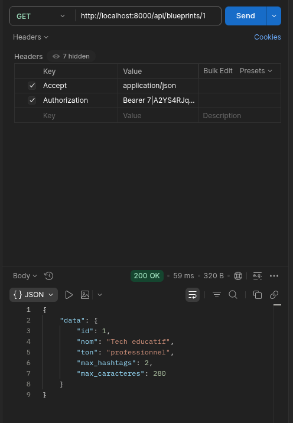
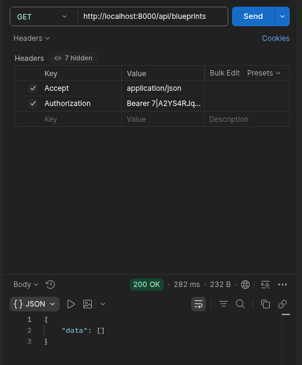

# LAB 1 — Routes API + Controller + réponse JSON

## Objectif
Reconstruire le squelette REST de la ressource `blueprints` : routes, controller, réponses JSON pour lister et afficher.

## Résultats

### GET /api/blueprints — 200 OK
Liste des blueprints de l'utilisateur authentifié.

### GET /api/blueprints/{id} — 200 OK
Un blueprint précis via route model binding.

## Constat
À ce stade, `index` et `show` renvoient `response()->json($model)` directement — donc **tous** les champs du modèle sortent, y compris `user_id` et les timestamps. C'est exactement ce que le LAB 2 va corriger avec une API Resource.
