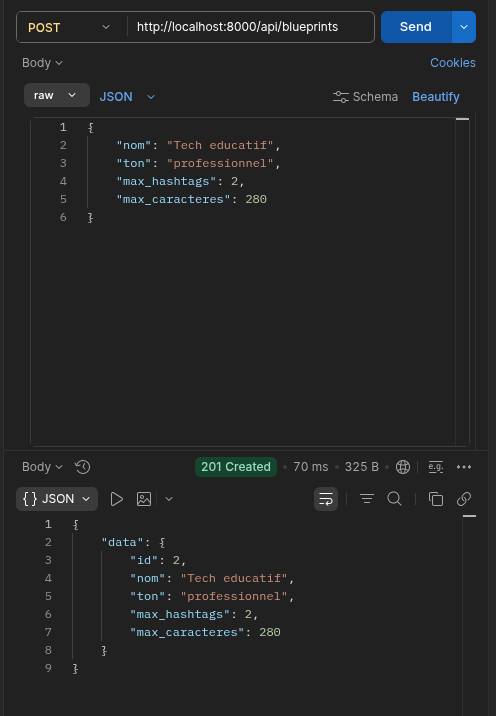
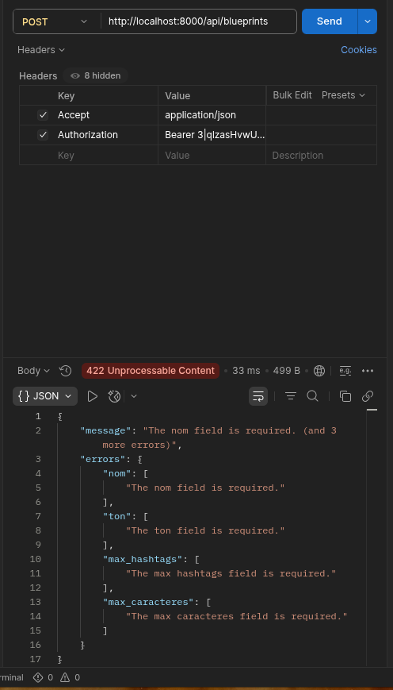

# LAB 2 — Form Request + status codes + API Resource

## Objectif
Sécuriser la création d'un blueprint : validation en entrée (422 si invalide), code 201 à la création, formatage en sortie via API Resource.

## Résultats

### POST /api/blueprints (valide) — 201 Created
Réponse formatée par `BlueprintResource` : uniquement `id`, `nom`, `ton`, `max_hashtags`, `max_caracteres`.

### POST /api/blueprints (invalide) — 422 Unprocessable Entity
Erreurs de validation renvoyées par `StoreBlueprintRequest`.

## Champ interne bloqué par la Resource
`Model::all()` (ou `response()->json($model)`) aurait exposé `user_id` et les timestamps (`created_at`, `updated_at`) — des données internes que `BlueprintResource` n'inclut jamais puisqu'elles ne sont pas listées dans `toArray()`.
