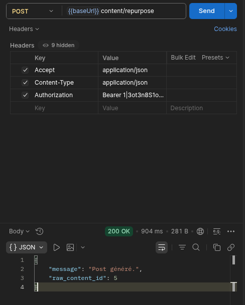

# LAB 3 — Appel IA synchrone (structured output + Casts)

## Objectif
Faire générer un post par l'IA avec un contrat JSON garanti, stocker le résultat typé. Tout se passe dans la requête (synchrone) — on observe la lenteur avant de la corriger au LAB 4.

## Ce qui a été mis en place
- Agent `PostGenerator` avec `#[Provider(Lab::Groq)]` et `#[Model('meta-llama/llama-4-scout-17b-16e-instruct')]`
- Schema structuré : `hook_propose`, `body_points`, `technical_readability_score`, `suggested_hashtags`, `tone_compliance_justification`
- Casts `array` sur `body_points` et `suggested_hashtags`, enum `StatutPost` sur `statut`

## Résultat Postman

`POST /api/content/repurpose` → **200 OK**

```json
{
    "message": "Post généré.",
    "raw_content_id": 5
}
```



**Temps de réponse observé : 904ms**
Ce délai représente le temps d'attente de l'IA dans la requête HTTP — la requête est bloquée pendant toute la durée de l'appel. C'est le problème que LAB 4 va résoudre.

## Vérification des Casts (Tinker)
- `$post->body_points` → tableau PHP réel (pas une string JSON)
- `$post->suggested_hashtags` → tableau PHP réel
- `$post->statut` → `StatutPost { name: "Draft", value: "draft" }` (enum, pas une string)

## Constat clé
La donnée brute en base est stockée en JSON string (`["point1","point2"]`).
Le Cast `array` la convertit automatiquement en tableau PHP à l'accès — aucun `json_decode` manuel nécessaire.
