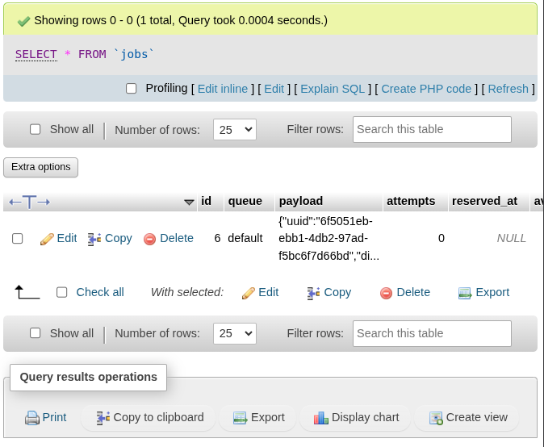
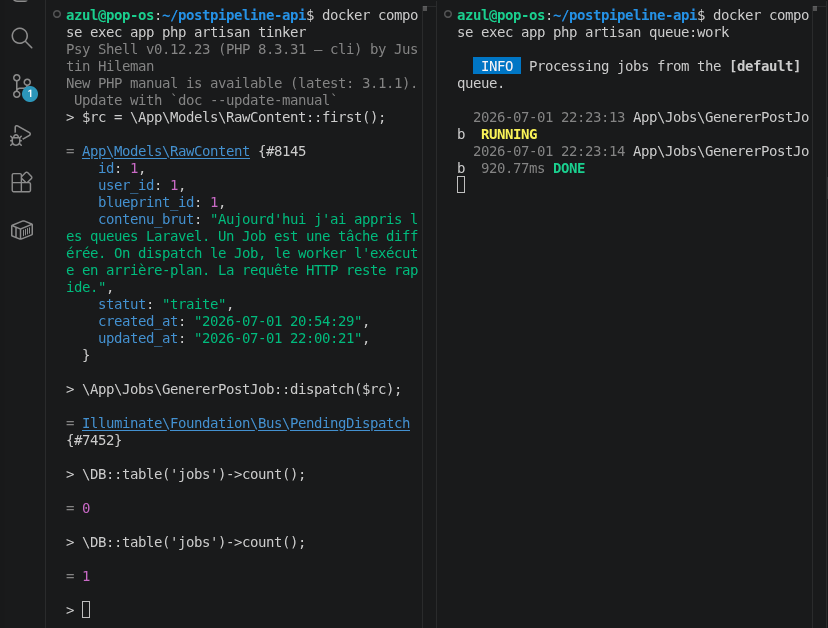
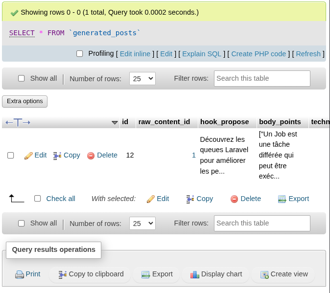

# LAB 4 — Déplacer la génération dans un Job

## Objectif
Sortir l'appel IA de la requête HTTP en le déplaçant dans un Job — comprendre le cycle complet : dispatch → jobs table → worker → résultat.

## Cycle observé

### Avant le worker
- `GenererPostJob::dispatch($rc)` → 1 ligne apparaît dans la table `jobs`
- `raw_content.statut` reste `en_attente`
- Aucun `generated_post` créé
- L'IA n'a pas été appelée

### Lancement du worker
docker compose exec app php artisan queue:work

2026-07-01 22:00:20 App\Jobs\GenererPostJob  RUNNING

2026-07-01 22:00:21 App\Jobs\GenererPostJob  1s DONE

### Après le worker
- `jobs` table : 0 lignes (job consommé et supprimé)
- `raw_content.statut` : `traite`
- `generated_post` créé avec hook : "Découvrez les queues Laravel pour améliorer les performances de vos applications !"

## Piège n°1 confirmé
Sans `queue:work` lancé, les Jobs s'accumulent dans la table `jobs` sans jamais s'exécuter.
Rien ne se passe silencieusement — c'est le bug le plus courant avec les queues.

## Différence queue:work vs queue:listen
- `queue:work` : charge le code en mémoire une fois, plus rapide — doit être redémarré après chaque modification du Job
- `queue:listen` : recharge le code à chaque Job — plus lent mais pratique en développement actif
